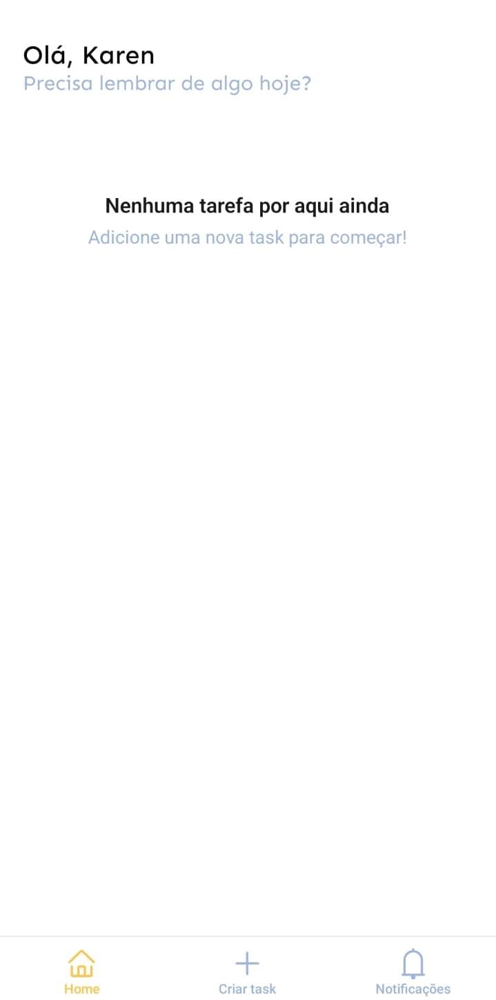
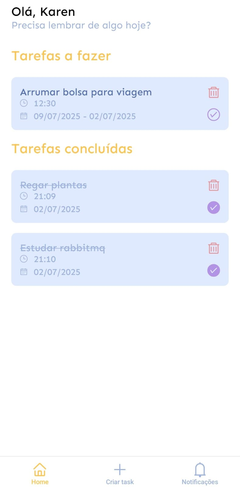
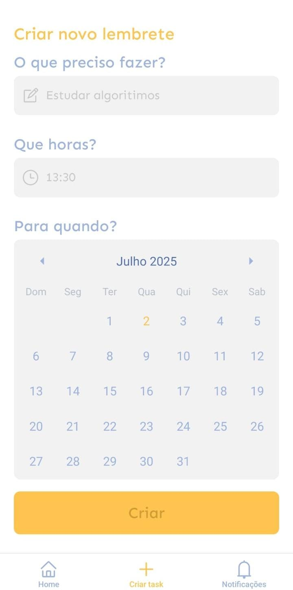
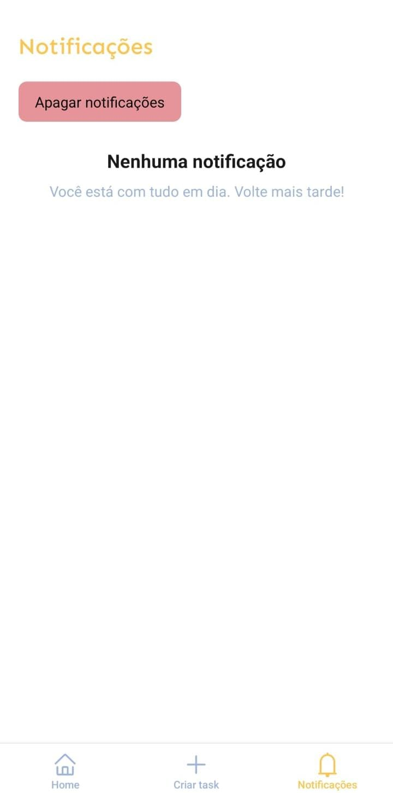
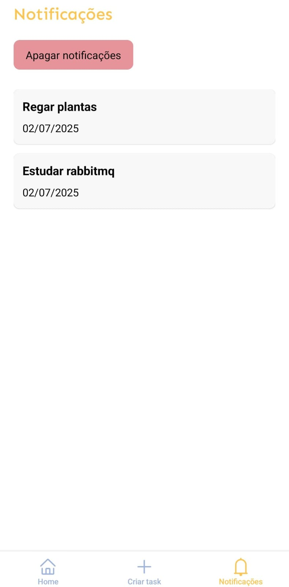
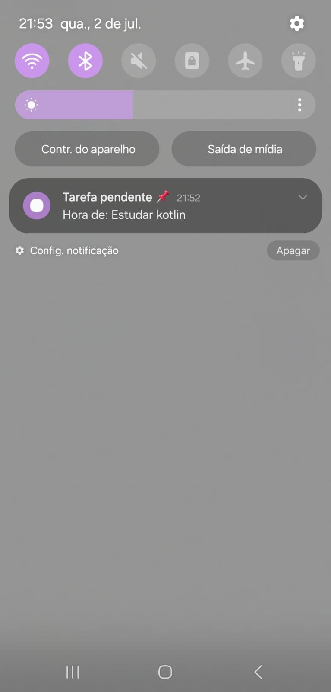

# 🕥 Recalli App

**Recalli** é um app que te ajuda a lembrar dos seus compromissos e tarefas diárias!  
Este projeto foi desenvolvido como solução para o **segundo desafio mobile do NADIC**, utilizando push notifications e deep linking.

---

## ✨ Funcionalidades

- ✅ Criação de tarefas com data e horário definidos
- 🔔 Lembretes via **push notifications**
- 💾 Armazenamento local das tarefas
- 🔗 Suporte a **deep linking** com expo-router para abrir tarefas diretamente
- 📦 Zustand para estados globais e armazenamento das notificações recebidas

---

## 🚀 Tecnologias utilizadas

- [React Native](https://reactnative.dev/)
- [Expo Notifications](https://docs.expo.dev/versions/latest/sdk/notifications/)
- [AsyncStorage](https://react-native-async-storage.github.io/async-storage/) com [Zustand](https://zustand-demo.pmnd.rs/)
- [Deep Linking](https://reactnavigation.org/docs/deep-linking/)
- [react-native-calendars](https://github.com/wix/react-native-calendars)
- [React Native Jest](https://jestjs.io/docs/tutorial-react-native)

---

## 📱 Preview

### Tela home sem tasks

<p align="center">
  
</p>

### Tela home com tasks

<p align="center">
  
</p>

### Tela de criar tasks

<p align="center">
  
</p>

### Tela de notificações recebeidas vazia

<p align="center">
  
</p>

### Tela de notificações

<p align="center">
  
</p>

### As notificações do app

<p align="center">
  
</p>
---

## 📂 Estrutura básica

```bash
📁 src
 ┣ 📂 @types
 ┣ 📂 app
 ┣ 📂 components
    ┣ 📂 Atoms
    ┣ 📂 Molecules
    ┣ 📂 Screens
 ┣ 📂 constants
 ┣ 📂 services
 ┣ 📂 utils


# Instale as dependências
npm install

# Inicie o projeto com o Expo
npx expo run:android

```
